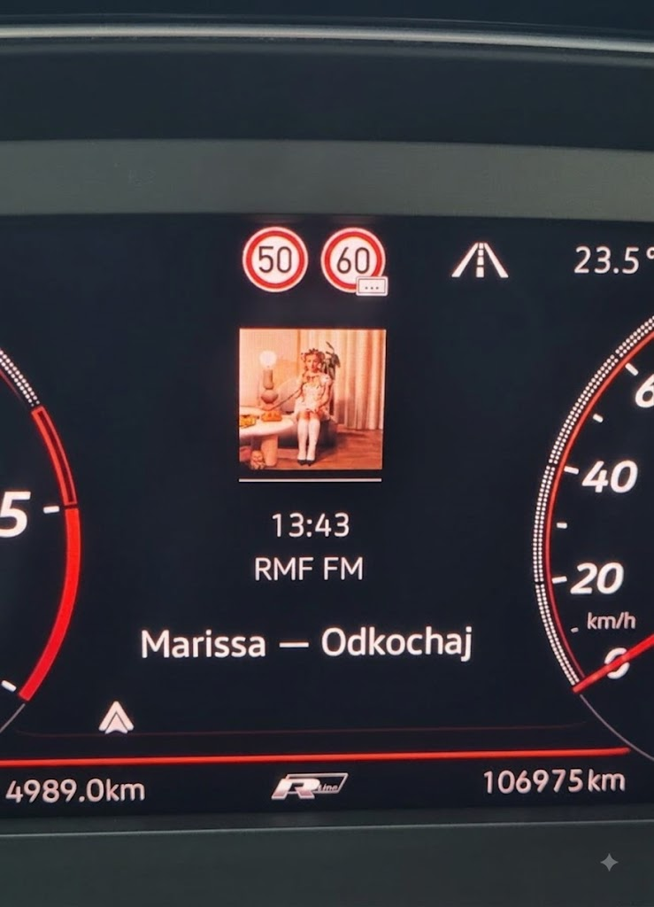
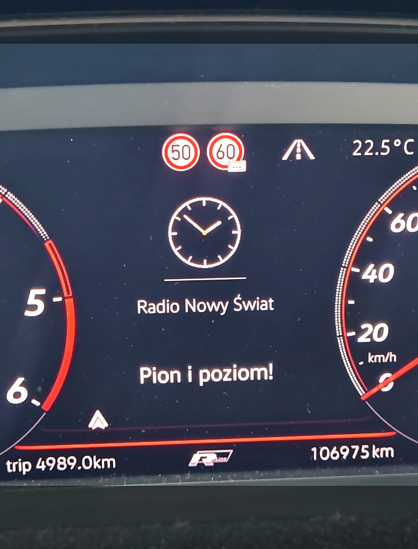
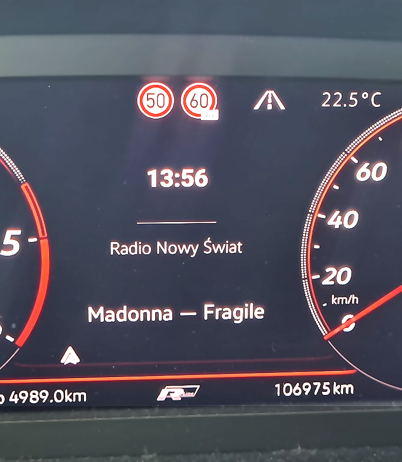

# Twinsen Radio

*An open-source internet radio player for Android Auto, built for a specific
car (VW Passat B8 MY2020, Discover Pro / Active Info Display). Not on Google
Play — clone it, build it yourself with Android Studio or the command line,
side-load it. GPLv3, fork away.*

An internet radio player for **Android Auto**, written for a specific car:
**VW Passat B8 MY2020** with Discover Pro and Active Info Display.

**This project is not, and will not be, on Google Play.** It's build-it-yourself —
you clone the repo, build it with Android Studio or the command line, and
side-load it onto your phone as a developer app. The code is fully open source
(GPLv3) — fork it, change it, do whatever you want with it, as long as you stick
to the license.

---

## In the car

Real photos of the Active Info Display in a VW Passat B8, not mockups.

<table>
<tr>
<td></td>
<td></td>
<td></td>
</tr>
</table>

---

## Why this project exists

Because the developers of existing radio apps either just ignored me or decided
that mapping their data to Android Auto's metadata fields wasn't worth their
time — even though their apps are paid. This one isn't.

There's a second reason: starting with the 2020 model year, VW decided the
Passat's Active Info Display would no longer show a clock — a decision the
owner community was not quiet about. This app puts one back, digital or
analog, in place of the cover art whenever you want it.

---

## How this was actually built

The entire codebase was written by [Claude Code](https://claude.com/claude-code)
— I don't know Kotlin, Java, or Android development. I drove this by describing
what I wanted, testing it in a real car, and reporting back what was wrong.

That has a consequence for you as a user or a fork-er: if you hit a bug, I
can't necessarily explain the code to you. If you can fix it yourself, please
do — pull requests welcome. If you can't, open a GitHub issue and I'll take a
look, but debugging turnaround depends on me finding time to sit in the car
again.

---

## Documentation

| File | What it covers |
|---|---|
| [BUILD.md](BUILD.md) | How to build it, install it, and run it. Procedures, gotchas, troubleshooting. |
| [ARCHITECTURE.md](ARCHITECTURE.md) | How it's built and **why**. Architecture and the reasoning behind decisions. |
| [FINDINGS.md](FINDINGS.md) | What we determined experimentally: which field ends up where, how stations behave, icon mapping in DHU. |
| [THIRD-PARTY-NOTICES.md](THIRD-PARTY-NOTICES.md) | Full list of libraries and network services the app uses. |
| [CLAUDE.md](CLAUDE.md) | Briefing for a new Claude Code session. Start there if you're returning to the project after a break. |

---

## What it can do

* Plays internet stations, with a browse tree in Android Auto:
  Favorites, All, Recent, Genres.
* Search for stations outside the built-in list via the radio-browser.info
  directory — by text and by voice, with search history.
* Multiple streams per station (different bitrates/codecs), with manual and
  remembered quality selection — including for built-in stations.
* Favorites and station list synced **live** between phone and car; your own
  stations (M3U or from the network), removal/restore, sorting.
* Custom station logos (uploaded from the phone) for cases where the built-in
  one doesn't fit.
* Track artwork from iTunes, falling back to MusicBrainz and Cover Art Archive.
* Detection of ads, station slogans, news bulletins, and control markers in
  the ICY stream; case normalization for stations that broadcast in ALL CAPS.
* Silent recovery after a signal loss — no error message reaches the car,
  and the player actively waits for the network to come back instead of
  giving up.
* Resuming after reconnect goes back to the **last station played**.
* Stream quality (codec, bitrate) shown and selectable on the playback screen.
* **Measured in the car:** the Active Info Display reads the `subtitle`,
  `description`, and `displayTitle` fields — see [FINDINGS.md](FINDINGS.md). What
  content goes into each of the three AID lines is chosen separately in
  Options.

---

## Quick start

```powershell
.\tools\install.ps1          # builds and installs on the connected phone
.\tools\dhu.bat               # virtual head unit on Windows, for testing without a car
```

The scripts in `tools/` are written for Windows + PowerShell (that's how the
author works). On Linux/macOS you'll build and install the same thing manually
via `./gradlew assembleDebug` and `adb install` — see [BUILD.md](BUILD.md)
for exact steps, required JDK/SDK versions, and what needs to be toggled on the
phone (Android Auto developer mode, USB debugging consent).

---

## Stations

32 stations are set as defaults in `app/src/main/assets/stations.json` — this
is the author's private pick, not an official partner list from any of them.
Polish: Radio Nowy Świat, Radio 357, RMF (FM, MAXXX, Classic, 24, Polskie Przeboje,
80s, Ballady), Radio ZET, Chilli ZET, Meloradio, Antyradio, Rockserwis.fm,
TOK FM, Kiss FM, Złote Przeboje, Polskie Radio (Jedynka, Dwójka, Trójka,
Czwórka, 24, Kierowców), ESKA, ESKA ROCK, VOX FM, Radio Plus, Radio Wnet.
International: triple j (Australia), smoothfm 80s (Australia), Kiss FM
Australia, Jacaranda FM (South Africa).

You can add your own stations two ways: an M3U list in Options, or the
in-app search (⋮ menu → *Search stations online*, radio-browser.info directory).

The default logo for each built-in station is a link to artwork hosted by the
station itself (see [Legal disclaimers](#legal-disclaimers)) — so it sometimes
looks different than you'd like (different background, lower quality,
sometimes none at all). If you'd rather use your own version, tap the logo on
the station details screen and upload your own image from the phone — it
overrides the default, locally, just for you.

---

## Project structure

```
app/src/main/java/net/mspanc/twinsenradio/
├── data/
│   ├── Station.kt               station model, stream variants
│   ├── StationRepository.kt     assets + M3U + directory stations, sorting
│   ├── RadioBrowser.kt          search on radio-browser.info
│   ├── StreamProbe.kt           on-demand stream availability probe
│   ├── M3uParser.kt             #EXTINF, tvg-logo, group-title
│   ├── Sorting.kt                list sorting criteria
│   ├── Prefs.kt                  settings; favorites and network stations as StateFlow
│   └── Presentation.kt           track description layouts, clock, colors
├── playback/
│   ├── RadioService.kt           MediaLibraryService: AA tree, session, ICY, artwork
│   ├── MetadataFactory.kt        builds MediaMetadata; ad and slogan detection
│   ├── CoverArtLookup.kt         iTunes, then MusicBrainz + Cover Art Archive
│   ├── LogoProvider.kt           logos served at a stable content:// address
│   ├── TextCase.kt               ALL-CAPS normalization and field ordering
│   ├── ClockArt.kt               clock drawn in place of artwork
│   ├── StreamQuality.kt          codec and bitrate description
│   ├── DiagnosticFields.kt       field → label map
│   ├── IcyFilteringDataSource.kt strips ICY in diagnostic mode
│   ├── InfiniteLoadErrorHandlingPolicy.kt
│   ├── ReconnectController.kt    ConnectivityManager + backoff + stall detection
│   ├── KeepCurrentStreamPlayer.kt        no restart for a station already playing
│   ├── ConnectionLog.kt          persistent log of connecting clients
│   └── PlaybackStatusBus.kt      service → phone UI channel
└── ui/
    ├── MainActivity.kt           list, search, mini-player, tabs
    ├── NowPlayingActivity.kt     full-screen player
    ├── DiscoverActivity.kt       online station search
    ├── StationInfoActivity.kt    station details, stream/logo editing
    ├── StreamPicker.kt           shared quality-selection dialog
    ├── SettingsActivity.kt       Options
    ├── StationAdapter.kt         station list (shared)
    └── ArtworkLoader.kt          fetches artwork/logos into an ImageView
```

Workshop tooling lives in [tools/](tools/) — documented in [BUILD.md](BUILD.md).

---

## Legal disclaimers

* **Station logos.** The app does not redistribute any station logos —
  `stations.json` only contains addresses (`logoUrl`) pointing to artwork
  hosted by the stations themselves or by the public radio-browser.info
  directory, similar to how a browser shows a site's favicon. Station names
  and logos are the property of their broadcasters; this project is not
  affiliated with or sponsored by any of them. Want a different look for a
  particular station's logo (e.g. a different background, higher resolution)?
  Upload your own image on the station details screen, see [Stations](#stations).
* **Audio streams.** The app is a thin ICY/HLS client — it only connects to
  the public stream addresses provided by the stations themselves, and it
  doesn't record or retransmit anything. Availability, legality, and content
  rights for each stream are the broadcaster's responsibility; make sure
  you're allowed to listen to a given station in your jurisdiction.
* **No warranty.** The code is provided under the GPLv3 license "as is",
  without any warranty — see [LICENSE](LICENSE), sections 15–16.

---

## License

```
Twinsen Radio — an internet radio player for Android Auto
Copyright (C) 2026  Leszek Szczepanowski

This program is free software: you can redistribute it and/or modify
it under the terms of the GNU General Public License as published by
the Free Software Foundation, either version 3 of the License, or
(at your option) any later version.

This program is distributed in the hope that it will be useful,
but WITHOUT ANY WARRANTY; without even the implied warranty of
MERCHANTABILITY or FITNESS FOR A PARTICULAR PURPOSE.  See the
GNU General Public License for more details.

You should have received a copy of the GNU General Public License
along with this program.  If not, see <https://www.gnu.org/licenses/>.
```

Full text: [LICENSE](LICENSE). List of libraries and their licenses:
[THIRD-PARTY-NOTICES.md](THIRD-PARTY-NOTICES.md).
